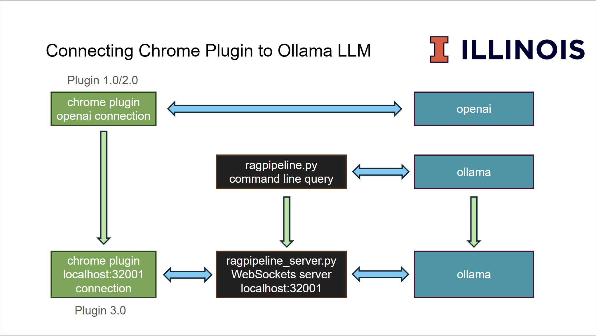

# Project Overview

This project focuses on creating an enhanced search tool for Amazon products by incorporating natural language capabilities into the product-search experience. Traditional Amazon browsing often involves a tedious, multi-step process including searching keywords, selecting an item, reading the description and multiple user reviews, adding it to a cart, and repeatedly refining the search. Our tool builds on existing search functionality by enabling users to express their product needs in more natural, descriptive language, moving beyond short, keyword-based queries. By leveraging modern large language models (LLMs), specifically an Ollama-based Retrieval-Augmented Generation (RAG) model, the system is capable of processing not only product descriptions but also the quality and relevance of user reviews. This allows the system to return the most relevant product based on the user's full, natural-language query. The core motivation is to simplify the process by allowing users to create more descriptive searches and removing the need to manually browse product pages, scan reviews, and compare similar items, thereby making the entire product-finding process a seamless, one-step interaction.

## Project flowchart

### This flowchart illustrates an evolution of our project thought process. Initially, Plugin 1.0/2.0 utilizes a Chrome plugin with an OpenAI connection to interact with the OpenAI API. The more advanced approach, embodied in Plugin 3.0, shifts to a fully local connection. In this setup, the Chrome plugin establishes a connection via localhost:32001 to a local WebSocket server run by ragpipeline_server.py. This server, in turn, interfaces with a locally hosted Ollama instance to serve the LLM. An intermediate path is also shown, where a command line query using ragpipeline.py can directly interact with an Ollama instance.